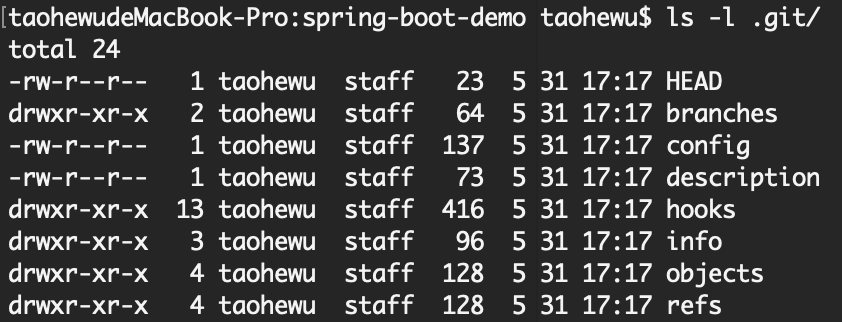

# 1 本地库操作

## 1.1 本地库初始化

- 命令：git init

- 效果：

  

- 注意：.git目录中存放的是本地库相关的子目录和文件，不要删除，也不要胡乱修改

## 1.2 设置签名

- 形式
  - 用户名：wxh
  - Email地址：wxh123@163.com
- 作用：区分不同的开发人员的身份
- 辨析：这里设置的签名和登录远程库(代码托管中心)的账号、密码没有任何关系。
- 命令
  - 项目级别/仓库级别：仅在当前本地库范围内有效
    - git config user.name wxh_pro
    - git config user.email wxh123_pro.@163.com
    - 信息保存路径：.git/config
  - 系统用户级别：登录当前操作系统的用户范围
    - git config --global user.name wxh-glb
    - git config --globel user.email wxh123_glb@163.com
    - 信息保存路径：~/.gitconfig
  - 优先级：优先使用项目级别

## 1.3 基本操作

- 查询工作区、暂存区状态：git status
- 将工作区新建/修改的文件添加到暂存区：git add [filename]
- 从暂存区删掉：git rm -- cached [filename]
- 将暂存区的内容提交到本地库：git commit -m "commit msg" [filename]

## 1.4 查看提交记录

- git log
- git log -\-pretty=oneline
- git log -\-oneline
- git reflog
  - HEAD@{移动到当前版本需要多少步}

## 1.5 版本回退

- git reset -\- hard [哈希值]

  - 可以后退，也可以前进

  - 参数说明

    | 参数     | 说明                       |
    | -------- | -------------------------- |
    | --soft   | 只修改本地库               |
    | -\-mixed | 修改本地库和暂存区         |
    | -\-hard  | 修改本地库、暂存区及工作区 |

- git reset HEAD^

  - 只能后退
  - n个^表示回退n个版本

- git reset HEAD~

  - 只能后退
  - 默认后退一个版本，~后加n表示后退n个版本

## 1.6 比较文件

- git diff [文件名]
  - 工作区与暂存区文件进行比较
- git diff [本地库中历史版本] [文件名]
  - 将工作区与某个历史版本进行比较
  - 不带文件名可以比较当前工作区中的所有文件
  - 例：
    - git diff HEAD [文件名]
    - git diff HEAD^ [文件名]
    - git diff [版本哈希值] [文件名]

## 1.7 分支管理

### 1.7.1 branch命令

- 命令格式：git branch [option]

- 选项说明：

  | 选项                                  | 说明                           |
  | ------------------------------------- | ------------------------------ |
  | 无                                    | 列出本地已经存在的分支         |
  | -v                                    | 显示最新提交记录               |
  | -a                                    | 显示所有分支                   |
  | -r                                    | 显示远程分支                   |
  | -vv                                   | 列出本地分支与远程分支关联关系 |
  | 分支名                                | 新建本地分支                   |
  | -D                                    | 删除本地分支                   |
  | -m oldName newName                    | 本地分支重命名                 |
  | \-\-set-upstream-to origin/branchName | 关联本地分支与远程分支         |

### 1.7.2 checkout命令

- 命令格式：

  - git checkout [option]

- 选项说明：

  | 选项                         | 说明                           |
  | ---------------------------- | ------------------------------ |
  | git checkout 分支名          | 切换分支                       |
  | git checkout \-\- 文件名     | 撤销工作区的修改，恢复到本地库 |
  | git checkout --ours 文件名   |                                |
  | git checkout --theirs 文件名 |                                |
  |                              |                                |

- git merge [有新内容的分支]
  
  - 分支合并
  
- git reset --hard HEAD 撤销合并

## 1.8 解决冲突

- 冲突的表现

  ~~~
  7 <<<<<<< HEAD
  8 hhhhhhh
  9 =======
  10 iiiiiii
  11 >>>>>>> dev
  ~~~

  - "<<<<<<< HEAD"到"======="之间为当前分支内容
  - "======="到"》">>>>>>>"之间为另一分支内容

- 冲突的解决
  1. 编辑文件，删除特殊符号
  2. 把文件修改到满意的程度，保存退出
  3. git add [文件名]
  4. git commit -m "日志信息"(注意：此时commit一定不能带具体文件名)

# 2 远程库操作

## 2.1 新建别名

~~~
git remote add origin https://github.com/wxh646121331/study-notes.git

//修改远程地址
git remote set-url origin https://github.com/wxh646121331/study-notes.git
~~~

## 2.2 查看远程库操作

~~~
taohewudeMacBook-Pro:study-notes taohewu$ git remote -v
origin	https://github.com/wxh646121331/study-notes.git (fetch)
origin	https://github.com/wxh646121331/study-notes.git (push)
~~~

## 2.3 push操作

### 2.3.1 推送到远程分支

~~~
git push origin master
~~~

### 2.3.2 删除远程分支

~~~
git push --delete origin branchName
~~~

## 2.4 克隆操作

~~~
git clone https://github.com/wxh646121331/test.git
~~~

## 2.5 抓取操作

~~~
git fetch origin master
~~~

- 注意：fetch操作只将origin下载到本地，并不会修改工作区，需要将origin合并到工作区

- 拉取
  - pull=fetch+merge
  - git fetch [远程库地址别名\] [远程分支名] 
  - git merge [远程库地址别名] [远程分支名\]

## 2.6 创建远程分支

```
git checkout -b my-test  //在当前分支下创建my-test的本地分支分支
git push origin my-test  //将my-test分支推送到远程
git branch --set-upstream-to=origin/my-test //将本地分支my-test关联到远程分支my-test上   
git branch -a //查看远程分支 
```

## 2.7 将远程git仓库里的指定分支拉取到本地（本地不存在的分支）

~~~
git checkout -b 本地分支名 origin/远程分支名
~~~


# 2 Git基本原理

## 2.1 哈希

- 哈希算法特别
  1. 不管输入数据的数据量有多大，输入同一个哈希算法，得到的加密结果长度固定
  2. 哈希算法确定，输入数据确定，输出数据能够保证不变
  3. 哈希算法确定，输入数据有变化，输出数据一定有变化，而且通常变化很大
  4. 哈希算法不可逆
- Git 底层采用的是SHA-1算法

## 2.2 Git保存版本的机制

### 2.2.1 集中式版本控制工具的文件管理机制

​	以文件变更列表的方式存储信息。这类系统将它们保存的信息看作是一组基本文件和每个文件随时间逐步累积的差异。

### 2.2.2 Git的文件管理机制

​	Git把数据看作是小型文件系统的一组快照

# 3 SSH登录

- 生成.ssh密钥目录

  ~~~
  ssh-keygen -t rsa -C wxh646121331@163.com
  ~~~

- 拷贝~/.ssh/id_rsa.pub文件内容

- 在GitHub中，进入settings->SSH and GPG keys，粘贴信息

- 创建SSH地址别名


