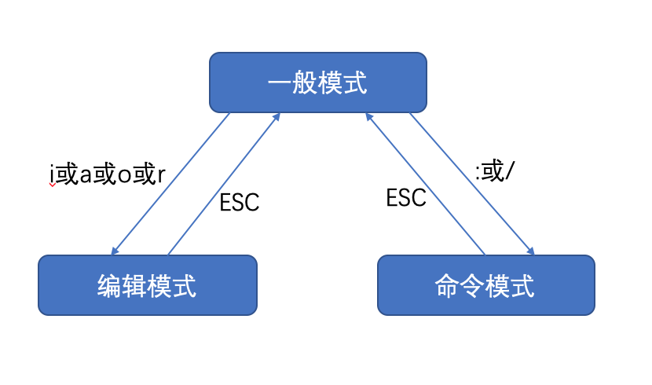
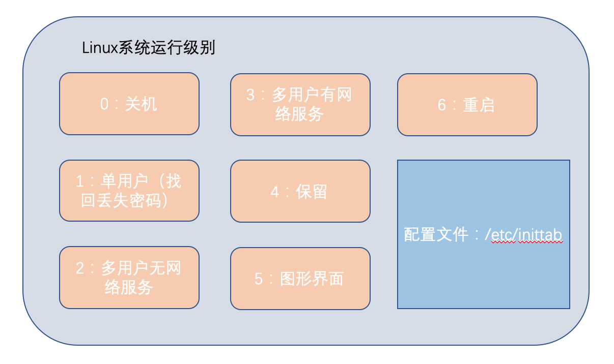

# 1. 用户与用户组

## 1.1 概述

Linux系统是一个多用户多任务的分时操作系统

## 1.2 用户

- 新增用户：useradd 用户名
  - useradd -g 用户组 用户名——新增用户并加入用户组
- 对用户设置密码：passwd 新建用户名，之后根据提示输入密码
- 用户是否存在：id 用户名
- 查看当前用户：whoami/who am i
- 切换用户：su - 用户名
- 删除用户：userdel
  - userdel 用户名——删除用户但保存用户主目录
  - userdel -r 用户名——删除用户和用户主目录
- 修改用户：usermod
  - usermod -g 用户组 用户名——将用户加入用户组

## 1.3 用户组

- 概述
- 新增组：groupadd 组名
- 删除组：groupdel 组名
- 修改组：groupmod组名
  - groupmod -n 新组名 老组名

## 1.4 与用户账号有关和系统文件

- 概述

- /etc/passwd

  ~~~
  wxh:x:1000:1001::/home/wxh:/bin/bash
  ~~~

  - 用户名
  - 口令
  - 用户标识号
    - 0号是超级用户root的标识号
    - 1~99由系统保留，用为管理账号，普通用户的标识号从100开始
  - 组标识号
  - 注释性描述
  - 主目录：用户的起始登录目录
  - 登录Shell：Shell是用户与Linux系统之间的接口

- /etc/shadow

  - 存放Linux加密后的口令

  - 登录名:加密口令:最后一次修改时间:最小时间间隔:最大时间间隔:警告时间:不活动时间:失效时间:标志

    ~~~
    wxh:$6$g.V25eYV$vySkAs66OBBbvNBlRjThZI3FxTh2Be.qKKHnAfCi.Kmp33xW01/QcdVEI5AC2kKsUObXfogaylVipA2xA7aLa0:18031:0:99999:7:::
    ~~~

  - 最后一次修改时间 ：从某个时刻起，到用户最后一次修改口令时的天数。时间起点对不同系统可能不一样。例如在Linux中，这个起始时间是1970年1月1日

  - 最小时间间隔：两次修改口令之间所需的最小天数

  - 最大时间间隔：口令保持有效的最大天数

  - 警告时间 ：从系统开始警告用户到用户密码正式失效之间的天数

  - 不活动时间 ：用户没有登录活动但账号仍能保持有效的最大天数

  - 失效时间：相应账号的生存期，用户能存活的天数

- /etc/group

# 2 常用基本命令

## 2.1 时间日期类

- date
  - date --help
  - date +%F' '%H:%M:%S
- cal
  - cal --help

## 2.2 文件目录类

- pwd
- ls：显示目录
  - ls -l
  - ls -d
  - ls -d 目录名
  - ls -a
  - ls -R ——递归查看
  - 别名 ll
- mkdir——创建一个新的目录
  - mkdir a
  - mkdir -p b/c
- rmdir——删除一个空目录
- touch——新建一个文件
- cd——切换目录
  - cd~ ——回到当前用户的home目录
- cp——复制文件或目录
- rm——移除文件或目录
  - rm -f 文件名——强制删除
  - rm -rf 目录——强制递归删除
- mv——移动文件与目录或修改名称
  - mv 文件名 新文件名
- cat——由第一行开始显示文件内容
  - cat -v——列出一些看不出来的特殊字符
- tac——从最后一行开始显示
- more——一页一页的显示文件内容
  - 空格键：代表向下翻一页
  - Enter：代表向下翻一行
  - q：代码立刻离开more
  - b：代表往回翻页
- less——与more类似
- head——只看头几行
- tail——只看尾部几行
- history——所敲命令历史
  - history >a.txt

## 2.3 文件权限类

## 2.4 网络配置类

- ifconfig

## 2.5 磁盘分区类

- 分区 
  - fdisk -l

## 2.6 搜索查找类

- find——查找文件或者目录
- grep——在文件内搜索字符串匹配的行并输出

## 2.7 进程线程类

- ps
  - ps -ef
  - ps 
- netstate

## 2.8 压缩和解压类

## 2.9 性能优化类

# 3 vi和vim编辑器

## 3.1 三种模式

- 正常模式：用vi打开一个文档就是正常模式，在这个模式下，可以使用[上下左右]按键来移动光标，可以使用[删除字符]或[删除整行]来处理文档内容，也可以使用[复制、粘贴]来处理文档数据

  - 在正常模式下，可以使用快捷键

  | 快捷键 | 说明                |
  | ------ | ------------------- |
  | yy     | 复制当前行          |
  | 5yy    | 复制当前行向下的5行 |
  | dd     | 删除当前行          |
  | 5dd    | 删除当前行向下的5行 |
  | p      | 粘贴                |
  | u      | 撤销上一步          |
  | gg     | 光标移动到最首行    |
  | G      | 光标移动到最末行    |
  | 5G     | 光标移动到第5行     |

  

- 插入模式：按下i,o,a,r任何一下字母可以切近到插入模式，在该模式下，可以输入内容

- 命令行模式：使用指令，完成读取、存盘、替换、离开、显示行号等功能

  | 命令      | 说明       |
  | --------- | ---------- |
  | wq        | 保存并退出 |
  | q         | 退出       |
  | q!        | 强制退出   |
  | set nu    | 显示行号   |
  | set  nonu | 隐藏行号   |

## 3.2 模式切换

# 4 实用指令

## 4.1 指定运行级别

- 指定运行级别：init [012356]

