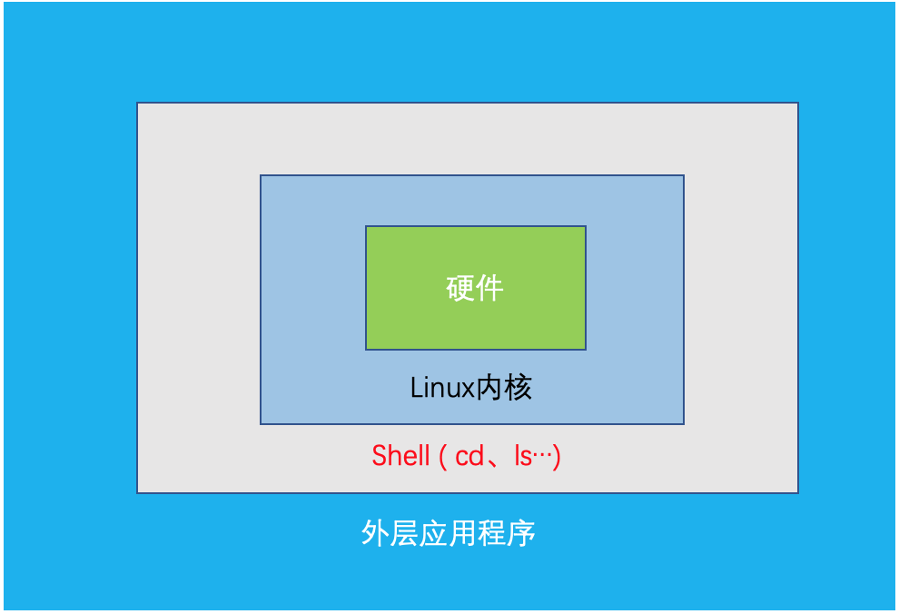

# 1 Shell概述

Shell是一个命令行解释器，它接收应用程序/用户命令，然后调用系统内核



Shell 还是一个功能相当强大的编程语言，易编写、易测试、灵活性强。

# 2 Shell解析器

- Linux提供的Shell解析器

  ~~~
  [root@785e20d57519 /]# cat /etc/shells
  /bin/sh
  /bin/bash
  /sbin/nologin
  /bin/dash
  /bin/tcsh
  /bin/csh
  ~~~

- bash和sh的关系

  ~~~
  [root@785e20d57519 bin]# ll | grep bash
  -rwxr-xr-x 1 root root  964608 Oct 30  2018 bash
  lrwxrwxrwx 1 root root      10 Mar  5 17:34 bashbug -> bashbug-64
  -rwxr-xr-x 1 root root    6964 Oct 30  2018 bashbug-64
  lrwxrwxrwx 1 root root       4 Mar  5 17:34 sh -> bash
  ~~~

- Centos默认的解析器是bash

  ~~~
  [root@785e20d57519 bin]# echo $SHELL
  /bin/bash
  ~~~

# 3 Shell脚本入门

## 3.1 脚本格式

​	脚本以#!/bin/bash开头(指定解析器)

## 3.2 第一个Shell脚本：helloworld

~~~
[wxh@785e20d57519 ~]$ touch helloworld.sh
[wxh@785e20d57519 ~]$ vi helloworld.sh
#!/bin/bash
echo helloworld
[wxh@785e20d57519 ~]$ sh ./helloworld.sh 
helloworld
~~~

## 3.3 第二个Shell脚本：多命令处理

~~~
[wxh@785e20d57519 ~]$ touch batch.sh
[wxh@785e20d57519 ~]$ vi batch.sh
#!/bin/bash
cd /home/wxh
touch wxh.txt
echo "I love you" >> wxh.txt
[wxh@785e20d57519 ~]$ sh ./batch.sh
~~~

# 4 Shell中的变量

## 4.1 系统变量

- 常用系统变量：
  - $HOME
  - $USER
  - $SHELL
  - $PWD
- 案例实操：echo $HOME

## 4.2 自定义变量

### 4.2.1 基本语法

1. 定义变量：变量=值
2. 撤销变量：unset 变量
3. 声明静态变量：readonly 变量，不能unset

### 4.2.2 变量定义规则

1. 变量名称可以由字母、数字和下划线组成，但是不能以数字开头，环境变量名建议大写
2. 等号两侧不能有空格
3. 在bash中，变量默认类型都是字符串，无法直接进行数值运算
4. 变量的值如果有空格，需要使用双引号或单引号括起来

### 4.2.3 案例实操

1. 定义变量A

   ~~~
   [wxh@785e20d57519 ~]$ A=1
   [wxh@785e20d57519 ~]$ echo $A
   1
   ~~~

2. 给变量A重新赋值

   ~~~
   [wxh@785e20d57519 ~]$ A=2
   [wxh@785e20d57519 ~]$ echo $A
   2
   ~~~

3. 撤销变量A

   ~~~
   [wxh@785e20d57519 ~]$ unset A
   ~~~

4. 声明静态变量B=2，不能unset

   ~~~
   [wxh@785e20d57519 ~]$ readonly B=2
   [wxh@785e20d57519 ~]$ echo $B
   2
   [wxh@785e20d57519 ~]$ unset B
   -bash: unset: B: cannot unset: readonly variable
   ~~~

5. 在bash中，变量默认类型都是字符串类型，无法直接进行数据运算

   ~~~
   [wxh@785e20d57519 ~]$ C=2+3
   [wxh@785e20d57519 ~]$ echo $C
   2+3
   ~~~

6. 变量的值如果有空格，需要使用引号括起来

   ~~~
   [wxh@785e20d57519 ~]$ D="I LOVE YOU"
   [wxh@785e20d57519 ~]$ echo $D
   I LOVE YOU
   ~~~

7. 可把变量提升为全局环境变量，可供其他shell程序使用

   ~~~
   #!/bin/bash
   echo helloworld
   echo $D
   [wxh@785e20d57519 ~]$ export D
   [wxh@785e20d57519 ~]$ sh helloworld.sh
   helloworld
   I LOVE YOU
   ~~~

## 4.3 特殊变量：$n

- 基本语法

  - 功能描述：n为数字，$0代表该脚本名称， \$1~\$9代表第一到第9个参数，10及以上的参数需要用大括号括起来，如\${10}

  - 案例实操

    ~~~
    [wxh@785e20d57519 ~]$ touch parameter.sh
    [wxh@785e20d57519 ~]$ vi parameter.sh 
    #!/bin/bash
    echo "$0 $1 $2 $3"
    [wxh@785e20d57519 ~]$ sh parameter.sh I love you
    parameter.sh I love you
    ~~~

## 4.4 特殊变量：$#

- 基本语法

  - $#
  - 获取所有输入参数的个数，常用于循环

- 案例实操

  ~~~
  [wxh@785e20d57519 ~]$ vi parameter.sh 
  #!/bin/bash
  echo "$0 $1 $2 $3"
  echo $#
  [wxh@785e20d57519 ~]$ sh parameter.sh I love you
  parameter.sh I love you
  3
  ~~~

## 4.5 特殊变量：$* 、\$@

- $*——代表命令行中所有的参数，把所有的参数看成一个整体
- $@——代表命令行中所有的参数，把每个参数区别对待

## 4.6 特殊变量：$?

- 最后一次执行的命令的返回状态，0代表执行正确，非0则表示执行不正确

# 5 运算符

- 基本语法

  - "$((运算式))"或"\$[运算式]"
  - expr + - * / %
    - 注意：expr运算符间要有空格

- 案例实操

  - 计算2+3的值

    ~~~
    [wxh@785e20d57519 ~]$ expr 2 + 3
    5
    ~~~

  - 计算(2+3)*4的值

    ~~~
    [wxh@785e20d57519 ~]$ expr `expr 2 + 3` \* 4
    20
    ~~~

    或

    ~~~
    [wxh@785e20d57519 ~]$ s=$[(2+3)*4]
    [wxh@785e20d57519 ~]$ echo $s
    20
    ~~~

# 6 条件判断

- 基本语法

  - [ condition ]
  - 注意：
    - confition前后都要有空格
    - 条件非空即为true

- 常用判断条件

  - 两个整数之间比较
    - = 字体串比较
    - -lt : less than
    - -le : less equal
    - -eq : equal
    - -gt : greater than
    - -ge : greater equal
    - -ne : not equal
  - 按照文件权限进行判断
    - -r
    - -w
    - -x
  - 按照文件类型进行判断
    - -f 文件存在且是一个常规的(file)
    - -e 文件存在(existence)
    - -d 文件存在且是一个目录

- 案例实操

  ~~~
  [wxh@785e20d57519 ~]$ [ 23 -lt 33 ]
  [wxh@785e20d57519 ~]$ echo $?
  0
  [wxh@785e20d57519 ~]$ [ 23 -ge 33 ]
  [wxh@785e20d57519 ~]$ echo $?
  1
  [wxh@785e20d57519 ~]$[ -w helloworld.sh ]
  [wxh@785e20d57519 ~]$ echo $?
  0
  ~~~

# 7 流程控制

## 7.1 if判断

- 基本语法

  >if [ 条件判断式 ];then
  >
  >​	程序
  >
  >fi

  或

  > if [ 条件判断式 ]
  >
  > ​	then
  >
  > ​		程序
  >
  > fi

- 注意

  - [ 条件判断式 ]，中括号和条件判断式之间必须有空格
  - if后有空格

- 案例实操

  ~~~
  [wxh@785e20d57519 ~]$ touch if.sh
  [wxh@785e20d57519 ~]$ vi if.sh
  #!/bin/bash
  if [ $1 -eq 1 ]
  then
  	echo "wxh"
  elif [ $1 -eq 2 ]
  then
  	echo "tsb"
  else
  	echo "else"
  fi
  [wxh@785e20d57519 ~]$ sh if.sh 1
  wxh
  [wxh@785e20d57519 ~]$ sh if.sh 2
  tsb
  [wxh@785e20d57519 ~]$ sh if.sh 3
  else
  ~~~

## 7.2 case语句

- 基本语法

  > case $变量名 in
  >
  > "值1")
  >
  > ​	程序
  >
  > ;;
  >
  > "值2")
  >
  > ​	程序
  >
  > ;;
  >
  > *）
  >
  > ​	程序
  >
  > ;;
  >
  > esac

- 案例实操

  ~~~
  [wxh@785e20d57519 ~]$ touch case.sh
  [wxh@785e20d57519 ~]$ vi case.sh 
  #!/bin/bash
  case $1 in
  1)
  	echo "wxh"
  ;;
  2)
  	echo "tsb"
  ;;
  *)
  	echo "else"
  ;;
  esac
  [wxh@785e20d57519 ~]$ sh case.sh 1
  wxh
  [wxh@785e20d57519 ~]$ sh case.sh 2
  tsb
  [wxh@785e20d57519 ~]$ sh case.sh 3
  else
  [wxh@785e20d57519 ~]$
  ~~~

## 7.3 for循环

- 基本语法

  > for((初始值;循环控制条件;变量变化))
  >
  > ​	do
  >
  > ​		程序
  >
  > ​	done

  或

  > for 变量 in 值1 值2 值3...
  >
  > ​	do
  >
  > ​		程序
  >
  > ​	done

- 案例实操

  - 从1加到100

    ```
    [wxh@785e20d57519 ~]$ touch for1.sh
    [wxh@785e20d57519 ~]$ vi for1.sh
    #!/bin/bash
    s=0
    for((i=0;i<=100;i++))
    do
    	s=$[$s+$i]
    done
    echo $s
    [wxh@785e20d57519 ~]$ sh for1.sh 
    5050
    ```

  - 打印所有输入参数

    ```
    [wxh@785e20d57519 ~]$ touch for2.sh
    [wxh@785e20d57519 ~]$ vi for2.sh
    #!/bin/bash
    for i in "$*"
    do
    	echo $i
    done
    for i in "$@"
    do 
    	echo $i
    done
    [wxh@785e20d57519 ~]$ sh for2.sh I love you
    I love you
    I
    love
    you
    ```

## 7.4 while循环

- 基本语法

  > while [ 条件判断式 ]
  >
  > ​	do
  >
  > ​		程序
  >
  > ​	done

- 案例实操

  ~~~
  [wxh@785e20d57519 ~]$ touch while.sh
  [wxh@785e20d57519 ~]$ vi while.sh
  #!/bin/bash
  s=0
  i=1
  while [ $i -le 100 ]
  do
  	s=$[$s+$i]
  	i=$[$i+1]
  done
  echo $s
  [wxh@785e20d57519 ~]$ sh while.sh 
  5050
  ~~~

# 8 read读取控制台输入

- 基本语法

  - read(选项)(参数)
  - 选项
    - -p: 指定读取值时的提示符
    - -t: 指定读取值时等待的时间(秒)
  - 参数
    - 变量：指定读取值的变量名

- 案例实操

  - 提示7秒内，读取控制台输入的名称

    ~~~
    [wxh@785e20d57519 ~]$ touch read.sh
    [wxh@785e20d57519 ~]$ vi read.sh
    #!/bin/bash
    read -t 7 -p "Enter you name in 7 seconds " NAME
    echo $NAME
    [wxh@785e20d57519 ~]$ chmod 777 read.sh 
    [wxh@785e20d57519 ~]$ ./read.sh
    Enter you name in 7 seconds wxh
    wxh
    ~~~

  - 

# 9 函数

## 9.1 系统函数

- basename

  - basename [string/pathname] [suffix]

  - basename 命令会删掉所有的前缀包括最后一个('/')字符，然后将字符串显示出来

  - 选项

    - suffix为后缀，如果suffix被指定了，basename会将pathname或string中的suffix去掉

  - 案例实操

    ~~~
    [wxh@785e20d57519 ~]$ basename /home/wxh/helloworld.sh 
    helloworld.sh
    [wxh@785e20d57519 ~]$ basename /home/wxh/helloworld.sh .sh
    helloworld
    ~~~

- dirname

  - dirname 文件绝对路径

  - 从给定的包含绝对路径的文件名中去除文件名，然后返回剩下的路径

  - 案例实操

    ~~~
    [wxh@785e20d57519 ~]$ dirname /home/wxh/helloworld.sh 
    /home/wxh
    ~~~

## 9.2 自定义函数

- 基本语法 

  > [ function ] funname[()]
  >
  > {
  >
  > ​	Action；
  >
  > ​	[return int;]
  >
  > }
  >
  > funname

- 规则

  - 必须在调用函数之前，先声明函数，Shell脚本是逐行运行，不会预先编译
  - 函数返回值，只能通过$?系统变量获得，可以显示加：return 返回，如果不加，将以最后一条命令运行结果作为返回值。return 后跟数据n(0~255)

- 案例实操

  - 计算两个输入参数的和

    ~~~
    [wxh@785e20d57519 ~]$ touch sum.sh
    [wxh@785e20d57519 ~]$ vi sum.sh
    #!/bin/bash
    function sum()
    {
    	s=0;
    	s=$[$1+$2]
    	echo $s
    }
    read -p "input your parameter1:" P1
    read -p "input your parameter2:" P2
    sum $P1 $P2
    [wxh@785e20d57519 ~]$ sh sum.sh
    input your parameter1:1
    input your parameter2:3
    4
    ~~~

# 10 Shell工具

## 10.1 cut

- cut的工作就是剪，就是在文件中负责剪切数据。cut命令从文件的每一行剪切字节、字符和字段并将这些字节、字符和字段输出

- 基本语法：cut [选项] filename

  - 默认分隔符是制表符
  - 选项
    - -f 列号，提取第几列
    - -d 分隔符，按照指定分隔符分割列

- 案例实操

  ~~~
  [wxh@785e20d57519 ~]$ touch cut.txt
  [wxh@785e20d57519 ~]$ vi cut.txt
  wxh wxh
  tsb tsb
  tzl tzl
  txy txy
  [wxh@785e20d57519 ~]$ cut -d " " -f 1 cut.txt
  wxh
  tsb
  tzl
  txy
  [wxh@785e20d57519 ~]$ cat cut.txt | grep wxh | cut -d " " -f 1
  wxh
  [wxh@785e20d57519 ~]$ echo $PATH | cut -d : -f 3-
  /usr/bin:/usr/local/sbin:/usr/sbin:/home/wxh/.local/bin:/home/wxh/bin
  ~~~

## 10.2 sed

- 基本语法

  - sed [选项] 'command' filename

  - 选项参数

    | 选项参数 | 功能                                |
    | -------- | ----------------------------------- |
    | -e       | 直接在指令列模式上进行sed的动作编辑 |

  - 命令功能参数

    | 命令 | 功能                                    |
    | ---- | :-------------------------------------- |
    | a    | 新增，a的后面可以接字符串，在一下行出现 |
    | d    | 删除                                    |
    | s    | 查找并替换                              |

- 案例实操

  ~~~
  [wxh@785e20d57519 ~]$ touch sed.txt
  [wxh@785e20d57519 ~]$ vi sed.txt
  [wxh@785e20d57519 ~]$ cat sed.txt
  dong shen
  guan zhen
  wo wo
  lai lai
  [wxh@785e20d57519 ~]$ sed '2a mei nv' sed.txt
  dong shen
  guan zhen
  mei nv
  wo wo
  lai lai
  [wxh@785e20d57519 ~]$ sed '/wo/d' sed.txt
  dong shen
  guan zhen
  lai lai
  [wxh@785e20d57519 ~]$ sed 's/wo/ni/g' sed.txt
  dong shen
  guan zhen
  ni ni
  lai lai
  [wxh@785e20d57519 ~]$ sed -e '2d' -e 's/wo/ni/g' sed.txt
  dong shen
  ni ni
  lai lai
  ~~~

## 10.3 awk

- 基本语法

  - awk [选项] 'pattern1{action1} pattern2{action2}…' filename 

    - pattern: 表示AWK在数据中查找的内容，就是匹配模式
    - action: 在找到匹配内容时所执行的一系列命令

  - 选项参数

    | 选项参数 | 功能                 |
    | -------- | -------------------- |
    | -F       | 指定输入文件的分隔符 |
    | -v       | 赋值一个用户定义变量 |

  - awk的内置变量

    | 变量     | 说明                                 |
    | -------- | ------------------------------------ |
    | FILENAME | 文件名                               |
    | NR       | 已读的记录数                         |
    | NF       | 浏览记录的域的个数(切割后，列的个数) |

- 案例实操

  - 搜索passwd文件以root关键字开头的所有行，并输出该行的第7行

    - 注意：只有匹配了pattern的行才会执行action

    ~~~
    [wxh@785e20d57519 ~]$ cp /etc/passwd ./
    [wxh@785e20d57519 ~]$ cat passwd 
    root:x:0:0:root:/root:/bin/bash
    bin:x:1:1:bin:/bin:/sbin/nologin
    daemon:x:2:2:daemon:/sbin:/sbin/nologin
    adm:x:3:4:adm:/var/adm:/sbin/nologin
    lp:x:4:7:lp:/var/spool/lpd:/sbin/nologin
    sync:x:5:0:sync:/sbin:/bin/sync
    shutdown:x:6:0:shutdown:/sbin:/sbin/shutdown
    halt:x:7:0:halt:/sbin:/sbin/halt
    mail:x:8:12:mail:/var/spool/mail:/sbin/nologin
    operator:x:11:0:operator:/root:/sbin/nologin
    games:x:12:100:games:/usr/games:/sbin/nologin
    ftp:x:14:50:FTP User:/var/ftp:/sbin/nologin
    nobody:x:99:99:Nobody:/:/sbin/nologin
    systemd-network:x:192:192:systemd Network Management:/:/sbin/nologin
    dbus:x:81:81:System message bus:/:/sbin/nologin
    wxh:x:1000:1001::/home/wxh:/bin/bash
    tzl:x:1001:1001::/home/tzl:/bin/bash
    [wxh@785e20d57519 ~]$ awk -F : '/^root/ {print $7}' passwd 
    /bin/bash
    [wxh@785e20d57519 ~]$ awk -F : '/^root/ {print $1","$7}' passwd 
    root,/bin/bash
    ~~~

  - 只显示/etc/passwd的第一列和第七列，以逗号分割，且在所有行前面添加列名user, shell，在最后一行添加"daheige /bin/zuishuai"

    - 注意：BEGIN在所有的数据读取行之间执行；END在所有数据执行之后执行

    ~~~
    [wxh@785e20d57519 ~]$ awk -F : 'BEGIN{print "user,shell"} {print $1","$7} END{print "daheige,/bin/wxh"}' passwd 
    user,shell
    root,/bin/bash
    bin,/sbin/nologin
    daemon,/sbin/nologin
    adm,/sbin/nologin
    lp,/sbin/nologin
    sync,/bin/sync
    shutdown,/sbin/shutdown
    halt,/sbin/halt
    mail,/sbin/nologin
    operator,/sbin/nologin
    games,/sbin/nologin
    ftp,/sbin/nologin
    nobody,/sbin/nologin
    systemd-network,/sbin/nologin
    dbus,/sbin/nologin
    wxh,/bin/bash
    tzl,/bin/bash
    daheige,/bin/wxh
    ~~~

  - 将passwd文件中的用户id增加数值1并输出

    ~~~
    [wxh@785e20d57519 ~]$ awk -F : -v i=1 '{print $3+i}' passwd 
    1
    2
    3
    4
    5
    6
    7
    8
    9
    12
    13
    15
    100
    193
    82
    1001
    1002
    ~~~

  - 统计passwd文件名，每行的行号，每行的列数

    ~~~
    [wxh@785e20d57519 ~]$ awk -F : '{print "filename:"FILENAME ", lineNumber:" NR ", columns:" NF}' passwd 
    filename:passwd, lineNumber:1, columns:7
    filename:passwd, lineNumber:2, columns:7
    filename:passwd, lineNumber:3, columns:7
    filename:passwd, lineNumber:4, columns:7
    filename:passwd, lineNumber:5, columns:7
    filename:passwd, lineNumber:6, columns:7
    filename:passwd, lineNumber:7, columns:7
    filename:passwd, lineNumber:8, columns:7
    filename:passwd, lineNumber:9, columns:7
    filename:passwd, lineNumber:10, columns:7
    filename:passwd, lineNumber:11, columns:7
    filename:passwd, lineNumber:12, columns:7
    filename:passwd, lineNumber:13, columns:7
    filename:passwd, lineNumber:14, columns:7
    filename:passwd, lineNumber:15, columns:7
    filename:passwd, lineNumber:16, columns:7
    filename:passwd, lineNumber:17, columns:7
    ~~~

  - 切割IP

    ~~~
    [wxh@785e20d57519 ~]$ ifconfig eth0 | grep "inet addr" | awk -F : '{print $2}' | awk -F " " '{print $1}'
    ~~~

  - 查询sed.txt中空行所在的行号

    ~~~
    [wxh@785e20d57519 ~]$ cat sed.txt 
    dong shen
    guan zhen
    wo wo
    
    lai lai
    [wxh@785e20d57519 ~]$ awk '/^$/{print NR}' sed.txt 
    4
    ~~~

## 10.4 sort

- 基本语法

  - sort(选项)(参数)

  - 选项说明

    | 选项 | 说明                     |
    | ---- | ------------------------ |
    | -n   | 依照数值的大小排序       |
    | -r   | 以相反的顺序来排序       |
    | -t   | 设置排序时所用的分隔字符 |
    | -k   | 指定需要排序的列         |

  - 参数：指定待排序的文件列表

- 案例实操

  - 按照"："分割后的第三列倒序排序

  ~~~
  [wxh@785e20d57519 ~]$ touch sort.sh
  [wxh@785e20d57519 ~]$ vi sort.sh 
  [wxh@785e20d57519 ~]$ cat sort.sh 
  bb:40:5.4
  bd:20:4.2
  xz:50:2.3
  cls:10:3.5
  ss:30:1.6
  [wxh@785e20d57519 ~]$ sort -t : -nrk 2 sort.sh 
  xz:50:2.3
  bb:40:5.4
  ss:30:1.6
  bd:20:4.2
  cls:10:3.5
  ~~~

## 10.5 uniq

# 11 实践

- 使用Linux命令查询file1中空行所在的行号

  ~~~
  [wxh@785e20d57519 ~]$ cat sed.txt 
  dong shen
  guan zhen
  wo wo
  
  lai lai
  [wxh@785e20d57519 ~]$ awk '/^$/{print NR}' sed.txt 
  4
  ~~~

- 计算第二列的和并输出

  ~~~
  [wxh@785e20d57519 ~]$ cat chenji.txt 
  wxh 40
  tsb 50 
  tzl 60
  [wxh@785e20d57519 ~]$ awk -F " " '{sum+=$2} END{print sum}' chenji.txt 
  150
  ~~~

- Shell脚本里如何检查一个文件是否存在？如果不存在该如何处理？

- 


