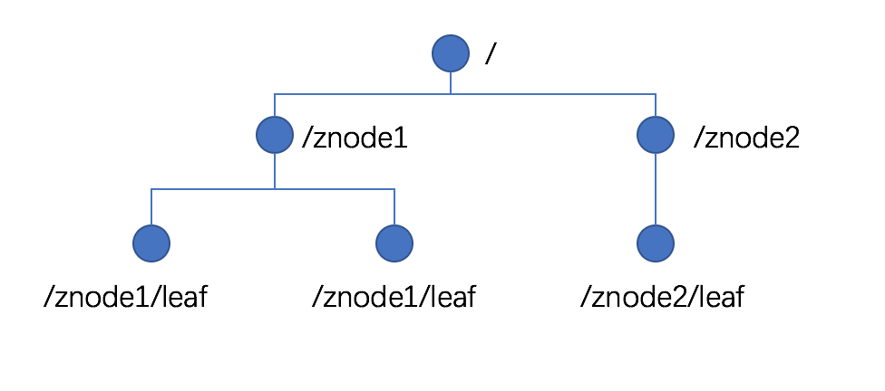

# 1 在Docker中搭建Zookeeper集群

- 下载Zookeeper镜像

  > docker pull zookeeper

- 启动zookeeper镜像

  > docker run \-\-name zookeeper01 -d zookeeper

- 启动日志

  > docker logs -f zookeeper01

- 进入容器

  > docker exec -it zookeeper01 /bin/bash

- 访问容器

  > docker run -it --rm --link zookeeper01:zookeeper zookeeper zkCli.sh -server zookeeper

  - 含义：
    - 启动一个zookeeper镜像，并运行这个镜像内的zkCli.sh命令，命令的参数是"-server zookeeper"；
    - 将我们先前启动的名为zookeeper01的容器链接(link)到我们新建的这个容器上，并其主机名命名为zookeeper

- 上传文件

  > docker cp test.txt zookeeper1:/test.txt

- 查看zookeeper的状态

  > /bin/zkServer.sh status


# 1 Zookeeper入门

## 1.1 概述

- Zookeeper 是一个开源的分布式的，为分布式应用提供协调服务的Apahe项目

- Zookeeper 工作机制

  - 从设计模式角度来理解：Zookeeper 是一个基于观察者模式设计的分布式服务管理框架，它负责存储和管理大家都关心的数据，然后接受观察者的注册，一旦这些数据的状态发生变化，Zookeeper 就将负责通知已经在Zookeeper上注册的那些观察都做出相应的反应

  - Zookeeper = 文件系统+通知机制

    

    

## 1.2 特点

- Zookeeper：一个领导者（Leader），多个跟随者（Follower）组成的集群
- 集群中只要有半数以上节点存活，Zookeeper 集群就能正常服务
- 全局数据一致：每个Server保存一份相同的数据副本，Client无论连接到哪个Server，数据都是一致的。
- 更新请求顺序进行，来自同一个Client的更新请求按其发送顺序依次执行
- 数据更新原子性，一次数据更新要么成功，要么失败
- 实时性，在一定时间范围内，Client能读到最新数据

## 1.3 数据结构

- Zookeeper数据模型的结构与Unix文件系统很类似，整体上可以看作是一棵树，每个节点称做一个ZNode。

- 每一个ZNode默认能够存储1MB的数据，每个ZNode都可以通过其路径唯一标识。

  

## 1.4 应用场景

- 统一命名服务

  - 在分布式环境下，经常需要对应用/服务进行统一命名，便于识别，例如：IP不容易记住，而域名容易记住

- 统一配置管理

  - 分布式环境下，配置文件同步非常常见
    - 一般要求一个集群中，所有节点的配置信息是一致的，比如kafka集群
    - 对配置文件修改后，希望能够快速同步到各个节点上
  - 配置管理可交由Zookeeper实现
    - 可将配置信息写入Zookeeper上的一个Znode
    - 各个客户端服务器监听这个Znode
    - 一旦Znode中的数据被修改，Zookeeper将通知各个客户端服务器

  

- 统一集群管理

  - 分布式环境中，实时掌握每个节点的状态是必要的
    - 可根据节点实时状态做出一些调整
  - Zookeeper可以实现实时监控节点状态变化
    - 可将节点信息写入Zookeeper上的一个ZNode
    - 监听这个ZNode可获取它的实时状态变化

- 服务器节点动态上下线

  - 客户端能实时洞察到服务器上下线的变化

- 软负载均衡

  - 在Zookeeper中记录每个服务器的访问数，让访问最少的服务器去处理最新的客户端请求

## 1.5 下载地址

https://zookeeper.apache.org/

# 2 Zookeeper安装

## 2.1 本地模式安装部署

- 安装前准备

  - 安装jdk

  - 拷贝安装包到Linux系统下

  - 解压到指定目录

    ```shell
    tar -zxvf zookeeper-3.4.14.tar.gz -C /opt/modele/
    ```

- 配置修改

  - 将conf/zoo_sample.cfg修改为zoo.cfg

  - 打开zoo.cfg文件，修改dataDir路径

    ```
    dataDir=.../zookeeper-3.4.14/zkData
    ```

  - 创建zkData文件夹

- 操作Zookeeper

  - 启动Zookeeper

    ```
    bin/zkServer.sh start
    ```

  - 查看进程是否启动

    ```
    admindeMacBook-Pro:zookeeper-3.4.14 wuxinhong$ jps
    67008 QuorumPeerMain
    65257 RemoteJdbcServer
    52895
    67022 Jps
    ```

  - 查看状态

    ```
    admindeMacBook-Pro:zookeeper-3.4.14 wuxinhong$ bin/zkServer.sh status
    ZooKeeper JMX enabled by default
    Using config: /Users/wuxinhong/Java/zookeeper-3.4.14/bin/../conf/zoo.cfg
    Mode: standalone
    ```

  - 启动客户端

    ```
    admindeMacBook-Pro:zookeeper-3.4.14 wuxinhong$ bin/zkCli.sh
    ```

  - 退出客户端

    ```
    quit
    ```

  - 停止Zookeeper

    ```
    bin/zkServer.sh stop
    ```

## 2.2 配置参数解读

- tickTime=2000：通信心跳数，Zookeeper服务器与客户端心跳时间，单位毫秒

  ​		Zookeeper使用的基本时间，服务器之间或客户端之间或客户端与服务器之间维持心跳的时间间隔，也就是每个tikeTime时间就会发送一个心跳，时间单位为毫秒

- initLimit=10：LF初始通信时限

  ​		集群中的Follower服务器与Leader服务器之间初始连接时能容忍的最多心跳数，用来限定集群中Zookeeper服务器连接到Leader的时限

- syncLimit=5：LF同步通信时限

  ​		集群中Leader与Follower之间的最大响应时间单位，假如响应超过syncLimit * tickTime，Leader认为Follower死掉，从服务器列表中删除Follower

- dataDir：数据文件目录+数据持久化路径

  主要用于保存Zookeeper中的数据

# 3 Zookeeper 内部原理

## 3.1 选举机制

## 3.2 节点类型

## 3.3 Stat结构体

## 3.4 监听器原理

## 3.5 写数据流程

# 4 Zookeeper实战

## 4.1 分布式安装部署

## 4.2 客户端命令行操作

## 4.3 API应用

## 4.4 监听服务器节点动态上下线案例

# 5 问题