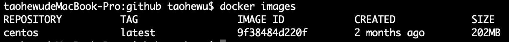

# 1 Docker简介

# 2 Docker安装

## 2.1 Docker的基本组成

## 2.2 安装步骤

## 2.3永远的HelloWorld

## 2.4阿里云镜像加速

- 是什么：https://dev.aliyun.com/search.html
- 注册阿里云账号
- 获得加速器地址: https://cr.console.aliyun.com/cn-hangzhou/instances/mirrors
- 重启Docker后台服务：service docker restart
- 检查加速器是否生效

## 2.5 启动Docker后台容器(测试运行hello-world)

## 2.6 底层原理

# 3 Docker常用命令

## 3.1 帮助命令

- docker -version
- docker info
- docker --help

## 3.1 镜像命令

###3.1.1 查看本地库所有的镜像

- docker images [options]

- 字段说明

  | 字段       | 说明         |
  | ---------- | ------------ |
  | REPOSITORY | 镜像的仓库源 |
  | TAG        | 镜像的标签   |
  | IMAGE ID   | 镜像ID       |
  | CREATED    | 镜像创建时间 |
  | SIZE       | 镜像大小     |

- REPOSITORY:TAG 定义不同版本的镜像

- OPTIONS说明

  | OPTION      | 说明                             |
  | ----------- | -------------------------------- |
  | -a          | 列出本地所有的镜像(含中间镜像层) |
  | -q          | 只显示镜像ID                     |
  | -\-digests  | 显示镜像的摘要信息               |
  | -\-no-trunc | 显示完整的镜像信息               |

###3.1.2 查找镜像

- docker search [OPTIONS] 镜像名

- 网站：https://hub.docker.com

- OPTIONS说明

  | OPTION       | 说明                            |
  | ------------ | ------------------------------- |
  | --no-trunc   | 显示完整的镜像描述              |
  | -s           | 列出收藏数不小于指定值的镜像    |
  | -\-automated | 只列出automated build类型的镜像 |

###3.1.3 拉取镜像

- docker pull 镜像名:tag

- 默认为latest版本

###3.1.4 删除镜像

- 删除单个：docker rmi -f imageID
- 删除多个：docker rmi -f 镜像名1:TAG 镜像名2:TAG
- 删除全部：docker rmi -f $(docker images -qa)

## 3.2 容器命令

### 3.2.1 新建并启动容器

- docker run [option] image [command] [arg...]

- option说明

  | 选项              | 说明                                                         |
  | ----------------- | ------------------------------------------------------------ |
  | --name="容器名称" | 为容器指定一个名称                                           |
  | -d                | 后台运行容器，并返回容器ID，即启动守护式容器                 |
  | -i                | 以交互模式运行容器，通常与-t同时使用                         |
  | -t                | 为容器重新分配一个伪输入终端，通常与-i同时使用               |
  | -P                | 随机端口映射                                                 |
  | -p                | 指定端口映射，4种格式：ip:hostPort:containerPort, ip::containerPort, hostPort:contianerPort, containerPort |

### 3.2.2 列出当前所有正在运行的所有容器

- docker ps [options]

- 选项说明

  | 选项         | 说明                                      |
  | ------------ | ----------------------------------------- |
  | -a           | 列出当前所有正在运行的容器+历史上运行过的 |
  | -l           | 上次运行的容器                            |
  | -n           | 前n次运行的容器                           |
  | -q           | 静默显示，只显示容器id                    |
  | \-\-no-trunc | 不截断输出                                |

###3.2.3 退出容器

- exit —— 容器停止退出
- ctrl+P+Q——容器不停止退出

###3.2.4 启动容器

- docker start 容器id/容器名

###3.2.5 重启容器

- docker restart 容器id/容器名

###3.2.6 停止容器

- docker stop 容器id/容器名

### 3.2.7 强制停止容器

- docker kill 容器id/容器名

###3.2.8 删除已停止的容器

- docker rm 容器id
- 删除多个容器
  - docker rm -f $(docker ps -a -q)
  - docker ps -a -q | xargs docker rm

###3.2.9 重要

- 后台运行

  - docker run -d 容器id
  - 注意：docker 容器后台运行，就必须有一个前台进行。容器运行的命令如果不是那些一直挂起的命令(如：top, tail)，就是会自动退出的。最佳的解决方案是程序以前台进行的形式运行
  - 例：docker run -d centos /bin/sh -c "while true;do echo hello zzyy;sleep 2;done"

- 查看容器日志

  - docker logs -f -t -\-taill 容器id

  - 选项说明

    | 选项     | 说明               |
    | -------- | ------------------ |
    | -t       | 加入时间戳         |
    | -f       | 跟随最新的日志打印 |
    | \-\-tail | 数字显示最后多少条 |

- 查看容器内运行的进程

  - docker top 容器ID

- 查看容器内部细节

  - docker inspect 容器ID

- 进入正在运行的容器并以命令行交互

  - docker attach 容器ID
    - 直接进入容器启动命令的终端，不会启动新的进程
  - docker exec -t 容器id bin/bash
    - 在是容器中打开新的终端，并且可以启动新的进程

- 从容器内拷贝文件到主机上

  - docker cp 容器ID:容器内路径 目的主机路径

# 4 Docker镜像

# 5 Docker容器数据卷

# 6 DockerFile解析

# 7 Docker常用安装

## 7.1 总体步骤

- 搜索镜像
- 拉取镜像
- 查看镜像
- 启动镜像
- 停止容器
- 移除容器

## 7.1 安装MySql

- docker search mysql

- docker pull mysql:5.6

- docker images

- docker run -d -p 12345:3306 --name mysql -v E:/docker/mysql/conf:/etc/mysql/conf.d -v E:/docker/mysql/logs:/logs -v E:/docker/mysql/data:/var/lib/mysql -e MYSQL_ROOT_PASSWORD=123456 -d mysql:5.6

  - 命令说明

    >-p 12345:3306   将主机的12345端口映射到docker容器的3306端口
    >
    >--name myssql  运行服务名字
    >
    >-v E:/docker/mysql/conf:/etc/mysql/conf.d 将主机E:/docker/mysql/conf目录下的my.cnf挂载到容器的/etc/mysql/conf.d
    >
    >-v E:/docker/mysql/logs:/logs 将主机E:/docker/mysql/logs目录挂载到容器的/logs
    >
    >-v E:/docker/mysql/data:/var/lib/mysql  将主机E:/docker/mysql/data挂载到容器的/var/lib/mysql
    >
    >-e MYSQL_ROOT_PASSWORD=123456   初始化root用户的密码
    >
    >-d mysql:5.6  后台程序运行mysql5.6

- docker exec -it 容器id /bin/bash

- mysql -uroot -p

- show databases;

- create database db01;

- use db01;

- create table t_book(id int not null primary key, book_name varchar(20));

- show tables;

- 备份数据库：docker exec 容器ID sh -c ' exec mysqldump --all-databases -uroot -p"123456" ' > E:/docker/mysql/all-databases.sql

## 7.2 安装Redis

# 8 本地镜像发布到阿里云

