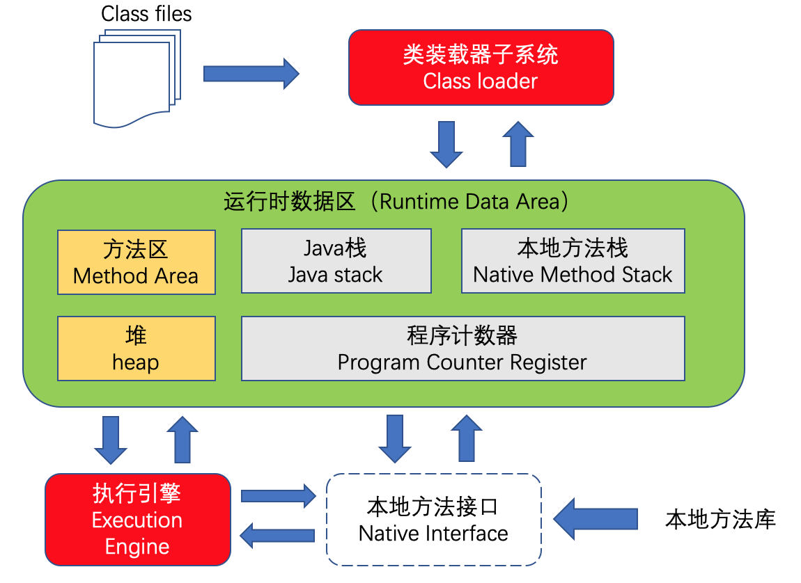

# 1 JVM内存结构

## 1.1 JVM体系概述

## 1.2 GC的作用域

- 主要作用于线程共有的方法区和堆

## 1.3 常见的垃圾回收算法

# 2 常考知识点

## 2.1 GC Roots

## 2.2 JVM调优和参数配置，盘点JVM系统默认值

## 2.3 JVM常用基本配置参数

## 2.4 强引用、软引用、弱引用、虚引用

## 2.5 OOM

## 2.6 GC垃圾回收算法和垃圾收集器的关系

## 2.7 查看服务器的默认垃圾收集器

## 2.8 G1垃圾收集器

## 2.9 生产环境服务器变慢，谈谈诊断思路和性能评估

## 2.10 生产环境出现CPU占用过高，如何定位

# 3 常用Linux命令

## 3.1 top

## 3.2 vmstat

## 3.3 pidstat

## 3.4 free

## 3.5 df

## 3.6 iostat

## 3.7 ifstat

## 3.8 CUP占用过高定位分析思路

# 4 JVM性能监控工具

## 4.1 jps

## 4.2 jstat

## 4.3 jinfo

## 4.4 jmap

