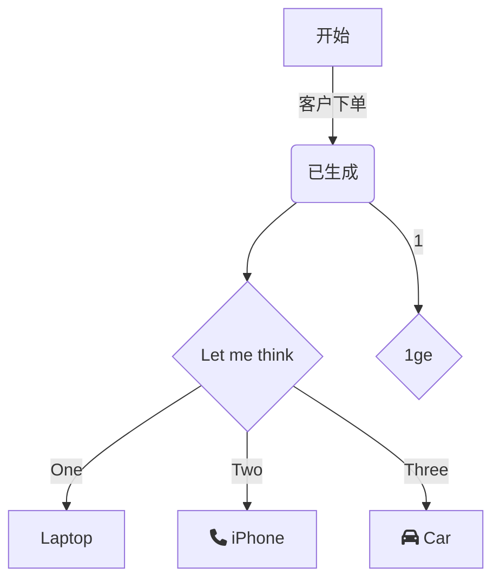

# 1 flow流程图

- 例

  ```flow
  st=>start: 开始:> http://www.baidu.com
      e=>end: 结束
      c1=>condition: 条件1:> http://www.baidu.com[_parent]
      op=>operation: 程序
      sub=>subroutine: 子程序
      io=>inputoutput: 输出
  
      st->c1(yes,right)->op(right)->sub(right)->io->e
      c1(no)->e
  ```

  

# 2 mermaid

## 2.1 流程图

### 2.1.1 图表方向

​	Mermaid 支持多种图表的方向，语法如下：

~~~
graph 方向描述
		图表中的其他语句...
~~~

​	其中"方向描述"为

| 用词 | 含义     |
| ---- | -------- |
| TB   | 从上到下 |
| BT   | 从下到上 |
| RL   | 从右到左 |
| LR   | 从左到右 |

### 2.1.2 节点定义

​	节点即流程中每个文本块，包括开始、结束、处理、判断等。Mermaid中的每个节点都有一个id，以及节点的文字。

| 表述       | 说明           |
| ---------- | -------------- |
| id[文字]   | 矩形节点       |
| id(文字)   | 圆角矩形节点   |
| id((文字)) | 圆形节点       |
| id>文字]   | 右向旗帜状节点 |
| id{文字}   | 菱形节点       |

- 注意：
  - 如果节点的文字中包含标点符号，需要时用双引号将所有的文字包裹起来，或者用单引号将标点符号包裹起来
  - 如果希望在文字中使用换行，请使用

### 2.1.3 节点间的连线

| 表述       | 说明           |
| ---------- | -------------- |
| >          | 添加尾部箭头   |
| -          | 不添加尾部箭头 |
| --         | 单线           |
| \-\-text-- | 单线上加文字   |
| ==         | 粗线           |
| ==text==   | 粗线上加文字   |
| -.-        | 虚线           |
| -.text.-   | 虚线加文字     |
| \|text\|   | 线上加文字     |

### 2.1.4 举例

~~~mermaid
graph TB
	start[开始]-->s{"fa:fa-truck 校验参数是否合法?"}
	s-.->|Y|d[fa:fa-taxi:fa-2x 操作排线]
	s==>|N|e((fa:fa-car end))
	d---f>fa:fa-home]
	
~~~


- 例子



