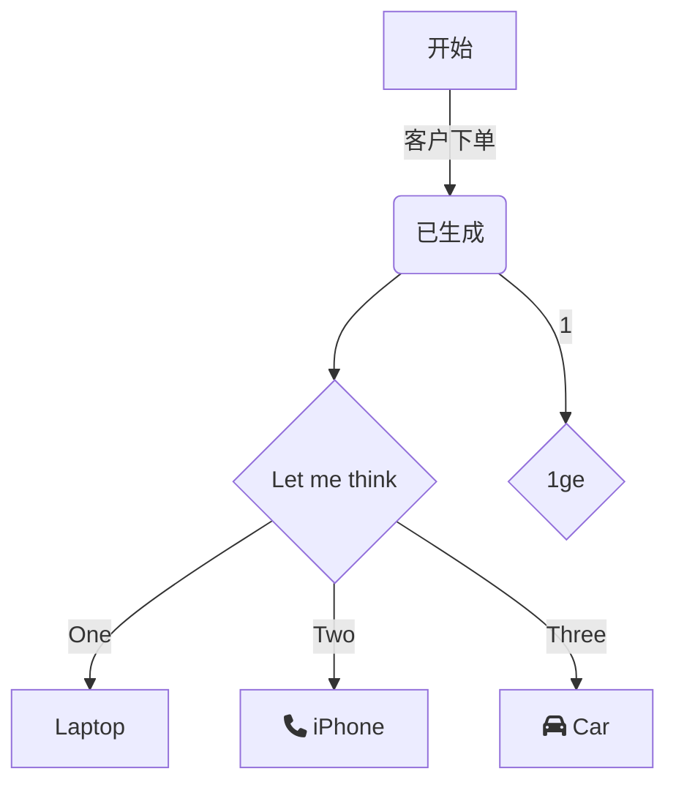

# 1 flow流程图

- 例

  ```flow
  st=>start: 开始:> http://www.baidu.com
      e=>end: 结束
      c1=>condition: 条件1:> http://www.baidu.com[_parent]
      op=>operation: 程序
      sub=>subroutine: 子程序
      io=>inputoutput: 输出
  
      st->c1(yes,right)->op(right)->sub(right)->io->e
      c1(no)->e
  ```

  

# 2 mermaid

- 例子



